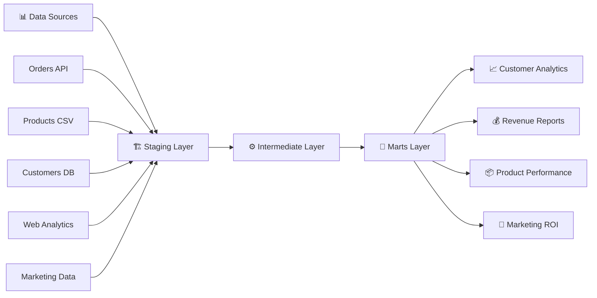
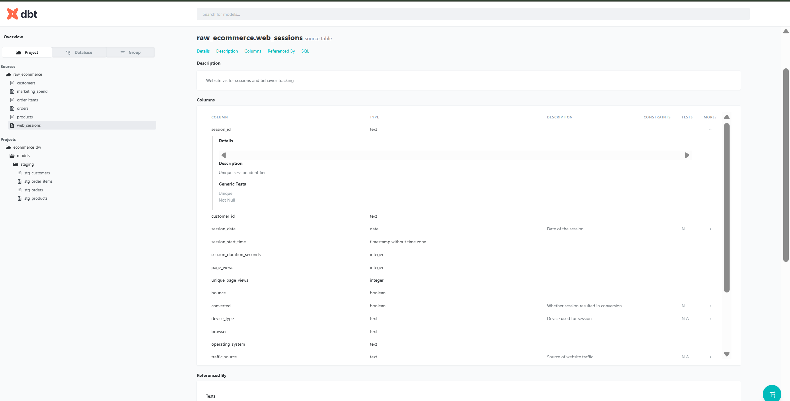

# 🛍️ Modern E-commerce Data Warehouse

<div align="center">


[](https://www.getdbt.com/)
[](https://www.postgresql.org/)
[](https://www.python.org/)
[](https://opensource.org/licenses/MIT)

**A production-ready data warehouse for e-commerce analytics built with dbt, PostgreSQL, and modern data engineering best practices.**

[📊 View Documentation](#-project-overview) • [🚀 Quick Start](#-quick-start) • [🏗️ Architecture](#️-architecture) • [📈 Analytics](#-key-business-metrics)

---

### 👩‍💻 **Built by [Maria Sarabando](https://www.linkedin.com/in/mariajoaosarabando)**
[](https://www.linkedin.com/in/mariajoaosarabando)
[](https://github.com/MJ-Sarabando)

</div>

## 🎯 Project Overview

This project demonstrates a **comprehensive data warehouse solution** for e-commerce analytics, showcasing modern data engineering practices and dimensional modeling techniques.

### ✨ **Key Features**
- 🔄 **Multi-source data integration** from various e-commerce touchpoints
- 📊 **Dimensional modeling** with star schema design
- ⚡ **Advanced dbt transformations** with incremental processing
- 🧪 **Automated data quality testing** and monitoring
- 🚀 **CI/CD pipeline** with GitHub Actions
- 📚 **Comprehensive documentation** and lineage tracking

## 🏗️ Architecture

### **Data Flow Overview**




### **Data Lineage & Transformations**


The lineage graph shows how raw data flows through staging, intermediate, and mart layers, creating a robust dimensional model for analytics.

## 📊 Data Model Deep Dive

### **Source Data Structure**


### **Dimensional Model Architecture**

#### 🎯 **Fact Tables**
- **`fact_orders`** - Order transactions with customer and financial metrics
- **`fact_order_items`** - Line-item details with product performance
- **`fact_web_sessions`** - Website visitor behavior and conversion tracking
- **`fact_marketing_spend`** - Marketing campaign performance and ROI

#### 📋 **Dimension Tables**
- **`dim_customers`** - Customer master with SCD Type 2 for historical tracking
- **`dim_products`** - Product catalog with hierarchical categories
- **`dim_dates`** - Complete date dimension with business calendar
- **`dim_geography`** - Location data for regional analysis

### **Model Documentation**


Every model includes comprehensive documentation with column descriptions, data types, and business logic explanations.

## 🚀 Quick Start

### **Prerequisites**
- 🐳 Docker and Docker Compose
- 🐍 Python 3.8+
- 📁 Git

### **1. Clone and Setup**

```bash
# Clone repository
git clone https://github.com/MJ-Sarabando/modern-ecommerce-datawarehouse
cd modern-ecommerce-datawarehouse

# Create virtual environment
python -m venv venv
source venv/bin/activate  # On Windows: venv\Scripts\activate

# Install dependencies
pip install -r requirements.txt
```

### **2. Start Local Database**

```bash
# Start PostgreSQL with Docker
docker-compose up -d postgres

# Verify database is running
docker-compose logs postgres
```

### **3. Generate Sample Data**

```bash
# Generate realistic e-commerce dataset
python scripts/generate_sample_data.py
```

**📈 Generated Dataset:**
- 🛍️ **10,000 customers** with realistic demographics
- 📦 **5,000 products** across multiple categories
- 🛒 **25,000 orders** with seasonal patterns
- 👨‍💻 **50,000 web sessions** with conversion tracking
- 💰 **Daily marketing spend** across channels

### **4. Setup dbt**

```bash
cd dbt_project

# Install dbt dependencies
dbt deps

# Test database connection
dbt debug

# Load seed data
dbt seed

# Run transformations
dbt run

# Execute tests
dbt test

# Generate documentation
dbt docs generate
dbt docs serve
```

## 📁 Project Structure

```
modern-ecommerce-datawarehouse/
├── 📊 data/                          # Generated sample data
│   ├── raw/                         # Raw CSV files
│   └── data_quality_report.json     # Data validation results
├── 🏗️ dbt_project/                   # dbt transformation logic
│   ├── models/
│   │   ├── 🔄 staging/              # Data standardization layer
│   │   │   ├── _sources.yml         # Source definitions
│   │   │   ├── stg_customers.sql
│   │   │   ├── stg_products.sql  
│   │   │   ├── stg_orders.sql
│   │   │   └── stg_order_items.sql
│   │   ├── ⚙️ intermediate/          # Business logic layer
│   │   │   ├── int_customer_metrics.sql
│   │   │   └── int_product_performance.sql
│   │   ├── 🎯 marts/                # Dimensional model
│   │   │   ├── core/                # Facts and dimensions
│   │   │   │   ├── fact_orders.sql
│   │   │   │   ├── dim_customers.sql
│   │   │   │   └── dim_products.sql
│   │   │   └── analytics/           # Business intelligence views
│   │   │       ├── customer_ltv.sql
│   │   │       └── product_performance.sql
│   │   └── 🛠️ utilities/             # Helper models
│   ├── 🔧 macros/                   # Reusable SQL functions
│   ├── 🧪 tests/                    # Custom data tests
│   ├── 📸 snapshots/               # SCD Type 2 implementation
│   └── dbt_project.yml             # dbt configuration
├── 🐍 scripts/                      # Python pipeline scripts
│   ├── generate_sample_data.py      # Data generator
│   ├── data_ingestion.py           # ETL pipeline
│   └── quality_checks.py           # Data validation
├── 🔄 .github/workflows/            # CI/CD automation
│   ├── dbt_ci.yml                  # dbt testing pipeline
│   └── data_quality.yml            # Quality monitoring
├── 🐳 docker-compose.yml           # Local development environment
├── 📋 requirements.txt             # Python dependencies
└── 📖 README.md                   # This file
```

## 🧪 Data Quality & Testing

### **Testing Strategy**
- ✅ **Referential integrity** between facts and dimensions
- 📊 **Business rule validation** (positive amounts, valid dates)
- ⏰ **Data freshness monitoring** with configurable thresholds
- 🚨 **Statistical outlier detection** for anomaly identification

### **Test Execution**
```bash
# Run all tests
dbt test

# Run specific test categories
dbt test --select staging
dbt test --select marts

# Generate test results report
dbt test --store-failures
```

### **Custom Test Example**
```sql
-- Test for reasonable order values
select count(*)
from {{ ref('fact_orders') }}
where total_amount > 10000 or total_amount < 0
```

## 📈 Key Business Metrics

### **🛍️ Customer Analytics**
- **Customer Lifetime Value (CLV)** - Revenue potential per customer
- **Churn Rate** - Customer retention analysis  
- **RFM Segmentation** - Recency, Frequency, Monetary scoring
- **Acquisition Cost (CAC)** - Marketing efficiency by channel

### **📦 Product Performance**
- **Product Revenue** - Top performing products and categories
- **Inventory Turnover** - Stock efficiency metrics
- **Margin Analysis** - Profitability by product line
- **Cross-sell Analysis** - Product affinity and bundling opportunities

### **💰 Sales Analytics**
- **Revenue Trends** - Daily, weekly, monthly, seasonal patterns
- **Order Size Distribution** - Basket analysis and optimization
- **Conversion Rates** - Funnel performance metrics
- **Geographic Performance** - Regional sales analysis

### **🎯 Marketing ROI**
- **Channel Performance** - Cost per acquisition by channel
- **Campaign Effectiveness** - ROAS (Return on Ad Spend)
- **Attribution Analysis** - Multi-touch attribution modeling
- **Budget Optimization** - Spend allocation recommendations

## 📊 Sample Business Intelligence Queries

### **Top Products by Revenue**
```sql
select 
    p.product_name,
    p.category_primary,
    sum(oi.line_total) as total_revenue,
    count(distinct oi.order_id) as order_count,
    avg(oi.line_total) as avg_line_value
from {{ ref('fact_order_items') }} oi
join {{ ref('dim_products') }} p on oi.product_id = p.product_id
group by 1, 2
order by total_revenue desc
limit 20;
```

### **Customer RFM Segmentation**
```sql
with customer_rfm as (
    select 
        c.customer_id,
        c.full_name,
        max(o.order_date) as last_order_date,
        count(o.order_id) as frequency,
        sum(o.total_amount) as monetary_value,
        current_date - max(o.order_date) as recency_days
    from {{ ref('dim_customers') }} c
    left join {{ ref('fact_orders') }} o on c.customer_id = o.customer_id
    group by 1, 2
)
select 
    customer_id,
    full_name,
    case 
        when recency_days <= 30 then 'Recent'
        when recency_days <= 90 then 'Active'
        when recency_days <= 180 then 'At Risk'
        else 'Lost'
    end as recency_segment,
    case 
        when frequency >= 10 then 'Frequent'
        when frequency >= 5 then 'Regular'
        when frequency >= 2 then 'Occasional'
        else 'One-time'
    end as frequency_segment,
    case 
        when monetary_value >= 1000 then 'High Value'
        when monetary_value >= 500 then 'Medium Value'
        else 'Low Value'
    end as monetary_segment
from customer_rfm;
```

### **Monthly Revenue Trends**
```sql
select 
    d.year_month,
    d.month_name,
    sum(o.total_amount) as monthly_revenue,
    count(distinct o.order_id) as order_count,
    count(distinct o.customer_id) as unique_customers,
    avg(o.total_amount) as avg_order_value
from {{ ref('fact_orders') }} o
join {{ ref('dim_dates') }} d on o.order_date = d.date_actual
where o.order_status = 'Delivered'
group by 1, 2
order by 1;
```

## 🔄 Incremental Processing

Support for efficient incremental processing of large datasets:

```sql
{{ config(
    materialized='incremental',
    unique_key='order_id',
    on_schema_change='fail'
) }}

select * from {{ ref('stg_orders') }}

    where order_date > (select max(order_date) from {{ this }})

```

## 🐳 Docker Environment

### **Included Services**
- 🐘 **PostgreSQL 15** - Primary data warehouse
- 🖥️ **pgAdmin** - Database administration interface
- 📊 **Metabase** - Business intelligence and visualization

### **Access URLs** (after `docker-compose up`)
- **Database**: `localhost:5432`
- **pgAdmin**: `http://localhost:8080` 
  - Email: `admin@ecommerce-dw.com` 
  - Password: `admin123`
- **Metabase**: `http://localhost:3000`

## 🚀 CI/CD Pipeline

### **Automated Workflows**
✅ **Pull Request Validation**
- dbt model compilation
- Data quality tests
- SQL linting and formatting

✅ **Main Branch Deployment**
- Full dbt run in staging
- Comprehensive test suite
- Documentation generation
- Production deployment (if tests pass)

### **GitHub Actions Configuration**
```yaml
name: dbt CI/CD
on: [push, pull_request]

jobs:
  test:
    runs-on: ubuntu-latest
    steps:
      - uses: actions/checkout@v3
      - name: Setup Python
        uses: actions/setup-python@v4
        with:
          python-version: '3.9'
      - name: Install dependencies
        run: pip install -r requirements.txt
      - name: Run dbt tests
        run: |
          cd dbt_project
          dbt deps
          dbt compile
          dbt test
```

## ⚡ Performance Optimization

### **Indexing Strategy**
```sql
-- Recommended indexes for fact tables
CREATE INDEX idx_fact_orders_customer_date ON fact_orders(customer_id, order_date);
CREATE INDEX idx_fact_orders_date ON fact_orders(order_date);
CREATE INDEX idx_fact_order_items_product ON fact_order_items(product_id);
CREATE INDEX idx_fact_order_items_order ON fact_order_items(order_id);
```

### **Table Partitioning**
```sql
-- Partition fact_orders by month for better performance
CREATE TABLE fact_orders_partitioned (
    LIKE fact_orders INCLUDING ALL
) PARTITION BY RANGE (order_date);

CREATE TABLE fact_orders_2023_01 PARTITION OF fact_orders_partitioned
    FOR VALUES FROM ('2023-01-01') TO ('2023-02-01');
```

## 🔍 Monitoring and Alerting

### **Data Freshness Monitoring**
```yaml
# models/staging/_sources.yml
sources:
  - name: raw_ecommerce
    freshness:
      warn_after: {count: 6, period: hour}
      error_after: {count: 12, period: hour}
```

### **Custom Data Quality Alerts**
```sql
-- Macro to alert on significant metric changes

    select 
        current_date,
        sum(total_amount) as daily_revenue
    from {{ ref('fact_orders') }}
    where order_date = current_date
    having sum(total_amount) < (
        select avg(daily_revenue) * 0.5
        from (
            select 
                order_date,
                sum(total_amount) as daily_revenue
            from {{ ref('fact_orders') }}
            where order_date >= current_date - interval '30 days'
            group by order_date
        ) recent_revenue
    )

```

## 🤝 Contributing

1. 🍴 Fork the repository
2. 🌿 Create a feature branch (`git checkout -b feature/amazing-feature`)
3. ✨ Make your changes
4. 🧪 Run tests (`dbt test`)
5. 💾 Commit changes (`git commit -m 'Add amazing feature'`)
6. 📤 Push to branch (`git push origin feature/amazing-feature`)
7. 🔄 Open a Pull Request

## 📋 Deployment Checklist

### **Pre-Production**
- [ ] All dbt tests passing
- [ ] Data quality validation completed
- [ ] Performance testing completed
- [ ] Security review completed
- [ ] Documentation updated
- [ ] Monitoring configured

### **Production Deployment**
- [ ] Environment variables configured
- [ ] Database connections tested
- [ ] Backup procedures verified
- [ ] Rollback plan prepared
- [ ] Stakeholder communication sent
- [ ] Post-deployment validation completed

## 📚 Additional Resources

### **📖 Learning Resources**
- [dbt Documentation](https://docs.getdbt.com/) - Official dbt documentation
- [dbt Best Practices](https://docs.getdbt.com/guides/best-practices) - Recommended patterns
- [Kimball Dimensional Modeling](https://www.kimballgroup.com/) - Industry standard approaches

### **🛠️ Tools & Extensions**
- [dbt Packages](https://hub.getdbt.com/) - Community packages and utilities
- [PostgreSQL Performance](https://www.postgresql.org/docs/current/performance-tips.html) - Official performance guide

## 📞 Support

- **🐛 Issues**: Use GitHub Issues for bug reports and feature requests
- **📚 Documentation**: Generated dbt docs available after running `dbt docs serve`
- **💬 Questions**: Check the dbt Community Slack or Stack Overflow

---

<div align="center">

**🛍️ Built with ❤️ using dbt, PostgreSQL, and modern data engineering best practices**

### **Connect with Maria Sarabando**
[](https://www.linkedin.com/in/mariajoaosarabando)
[](https://github.com/MJ-Sarabando)

*Showcasing modern data engineering expertise through practical implementation*

</div>